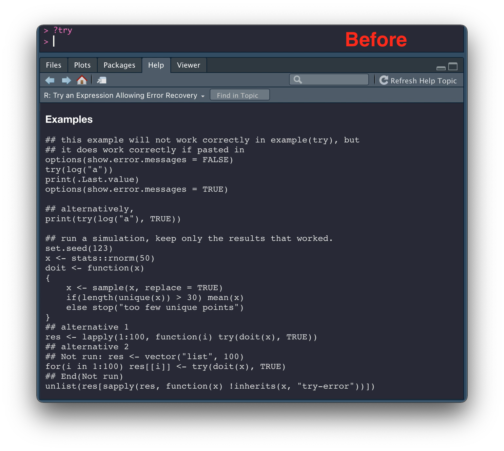
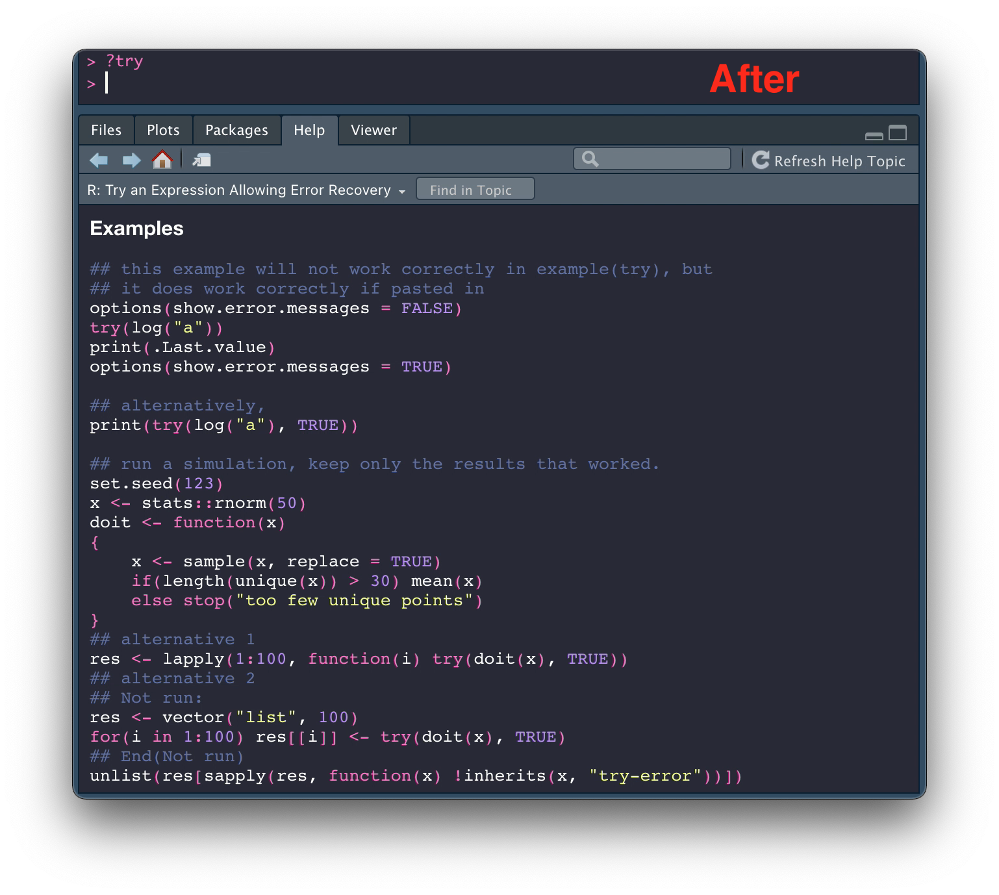

# Syntax highlighting for R HTML documentation


Overview
--------

This package enables syntax highlighting for R HTML documentation.

Syntax highlighting follows RStudio theme when running RStudio. When running outside RStudio, theme customization is supported, with Textmate set as the default. See [Themes](#themes) for more details.

The syntax highlighter comes from [Ace text editor](https://ace.c9.io/), the same editor underlying RStudio.



Related [rstudio/rstudio#2303](https://github.com/rstudio/rstudio/issues/2303)

Installation
------------

The package can be installed via [R-universe](https://kiendang.r-universe.dev) (recommended)

```r
install.packages("rdocsyntax", repos = "https://kiendang.r-universe.dev")
```

or Github

```r
# install.packages("remotes")
remotes::install_github("kiendang/rdocsyntax")
```

Usage
-----

### Enable syntax highlighting

```r
rdocsyntax::highlight_html_docs()
```

Code in HTML documents is now highlighted

```r
?try
```

If help pages are not displayed in HTML mode by default, *e.g.* when R is not running inside RStudio, set `help_type` option to `html`:

```r
help(try, help_type = "html")
```

or

```r
options(help_type = "html")
?try
```

### Disable syntax highlighting

```r
rdocsyntax::unhighlight_html_docs()
```

### Enable syntax highlighting automatically on startup

Append

```r
rdocsyntax::highlight_html_docs()
```

to your `.Rprofile`

*__Warning__: This might cause failure when upgrading R packages. It is recommended to comment out that line in `.Rprofile` before you run `update.packages()`*.

Extras
------

### Themes

When running inside RStudio, syntax highlighting always follows RStudio theme.

When running outside RStudio, theme can be changed by setting the `rdocsyntax.theme` option. Valid choices are:

  - Light themes: `chrome`, `clouds`, `crimson_editor`, `dawn`, `dreamweaver`, `eclipse`, `github`, `iplastic`, `katzenmilch`, `kuroir`, `solarized_light`, `sqlserver`, `textmate`, `tomorrow`, `xcode`
  - Dark themes: `ambiance`, `chaos`, `clouds_midnight`, `cobalt`, `dracula`, `gob`, `gruvbox`, `idle_fingers`, `kr_theme`, `merbivore`, `merbivore_soft`, `mono_industrial`, `monokai`, `nord_dark`, `one_dark`, `pastel_on_dark`, `solarized_dark`, `terminal`, `tomorrow_night`, `tomorrow_night_blue`, `tomorrow_night_bright`, `tomorrow_night_eighties`, `twilight`, `vibrant_ink`

*e.g.* to switch to `dracula`:

```r
options(rdocsyntax.theme = "dracula")
```

The default theme is `textmate` in case `rdocsyntax.theme` is not set or set to an invalid value.

### Vignette syntax highlighting

Due to security reasons by default only code in `?` help pages is syntax highlighted. Syntax highlighting for other pages served by the dynamic help server `httpd` including vignettes can be enabled by setting

```r
options(rdocsyntax.extra = TRUE)
```

Code in most vignettes has already been highlighted by default without the need for `rdocsyntax`. However one might still want to enable `rdocsyntax` for vignettes so that the color scheme matches that of RStudio. This is particularly useful with dark RStudio themes since most vignettes use textmate color scheme, which is a light theme and not dark mode friendly, for syntax highlighting.

`rdocsyntax.extra = TRUE` does not affect user defined `httpd` endpoints under `/custom/`, only those under `/doc/` and `/library/`.

### Inline `## Not run`

There are `## Not run` code examples that are single line. *e.g* in `?rstudioapi::highlightUi`

```r
## Not run: rstudioapi::highlightUi("#rstudio_workbench_panel_git")
```

The code will not be syntax-highlighted because the whole line is treated as a comment.

The solution we use is to turn it into

```r
## Not run:
rstudioapi::highlightUi("#rstudio_workbench_panel_git")
```

in the generated html.

### Debug mode

To show errors from `rdocsyntax` `httpd` help server for development/debugging purpose:

```r
options(rdocsyntax.dev = TRUE)
```

### Implementation details

R HTML help pages are rendered and served by the internal help server `httpd`. The package works by replacing the original `httpd` with one that receives the original HTML doc, makes changes to the HTML so that parts of the doc that contains code would be highlighted, then serves the modified HTML.

#### Client side and server side highlighting

The code that does the highlighting is written in JavaScript since it depends on the [Ace static highlighter](https://github.com/ajaxorg/ace/blob/v1.4.12/lib/ace/ext/static_highlight.js). Previously, up to `v0.5.x`, highlighting was done *server side*, *i.e.* `rdocsyntax` used `V8` to execute the JavaScript code and finished highlighting the HTML doc before returning it through `httpd`.

Starting from `v0.6.0`, highlighting has instead been done *client side*. The JavaScript highlighting code is injected into the original HTML doc in a `script` tag and then executed by whatever browser that eventually displays the doc, either RStudio or an external browser. Compared to server side highlighting, this is more efficient since `rdocsyntax` no longer has to run its own JavaScript engine. As a result, the heavy dependency on `V8` has been dropped.

Legacy server side highlighting is still available on an opt-in basis.

```r
options(rdocsyntax.server_side_highlighting = TRUE)
```

Of course `V8` needs to be installed for this to work.

<details>
  <summary><i>some caveats regarding <code>V8</code></i></summary>

  `V8` the R package depends on `libv8`. If you are on Linux you need to either install `libv8` from the package manager of your distro, compile `libv8` yourself or run the following commands to automatically download a suitable static build of `libv8` during installation of the `V8` R package (`>= 3.4`)

  ```r
  Sys.setenv(DOWNLOAD_STATIC_LIBV8 = 1)
  install.packages("V8")
  ```

  This is not required for MacOS or Windows since binary installation of `V8` (the R package) is available. See [`jeroen/V8`](https://github.com/jeroen/V8) for more details.

  Handling of inline `## Not run` is only available for `v8` versions that support positive lookbehind regex (probably `>= 5.1.281`). See [#2](https://github.com/kiendang/rdocsyntax/issues/2).

  To check your `v8` version

  ```r
  ctx <- V8::v8()
  ctx
  # <V8 engine 8.3.110.9>
  #  $assign(name, value, auto_unbox = TRUE, ...)
  #  $call(fun, ..., auto_unbox = TRUE)
  #  $console()
  #  $eval(src, serialize = FALSE)
  #  $get(name, ...)
  #  $reset()
  #  $source(file)
  #  $validate(src)
  ```
</details>

#### CRAN?

Due to `rdocsyntax` directly overriding `tools:::httpd` it is unlikely to be submitted to CRAN. Overwriting an object, especially an unexported one, in another package's namespace, is considered an anti-pattern. An alternative implementation that does not involve replacing the internal `httpd` can be found at [`kiendang/rdocsyntax.ex`](https://github.com/kiendang/rdocsyntax.ex) (now unmaintained). `rdocsyntax.ex` does not integrate as nicely with RStudio: help pages are displayed in the Viewer instead of Helper pane and extra functionalities such as search, forward, backward are not available.

## Development

requirements: [`yarn`](https://yarnpkg.com/)

clone the repo

```sh
git clone --recursive https://github.com/kiendang/rdocsyntax.git
```

install js dependencies

```sh
yarn install
```

rebuild the javascript files (only needed if the files in `srcjs` are updated)

```sh
yarn build
```

The built files are placed in `inst/js`.
